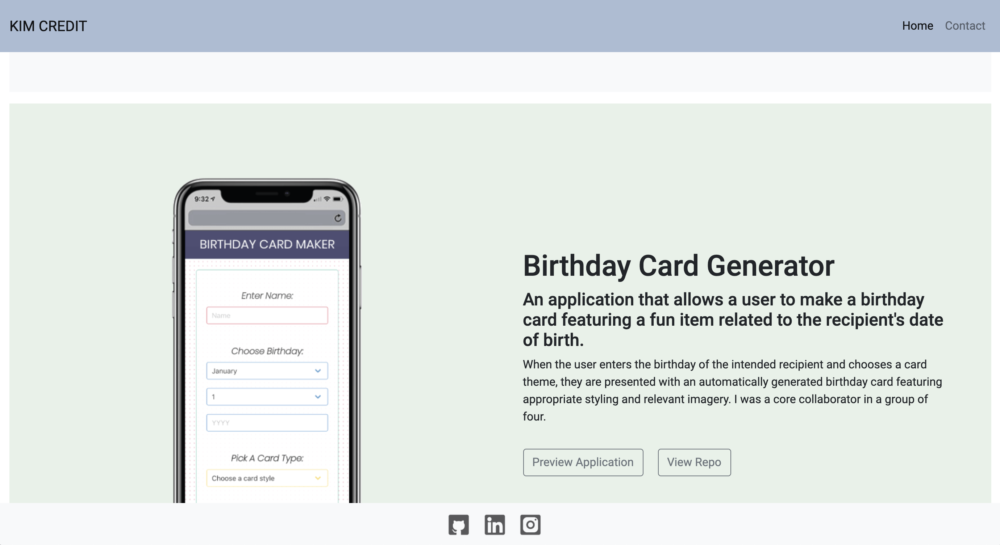

# portfolio

This is a basic portfolio website showing off my current project

It features a link to my completed project with an area for more projects to come. 

It also has a contact page for future engagement, though right now this remains functionless as the site is not fully deployed for employers to view. 

Preview the site here: https://kimcredit.github.io/portfolio-two/
